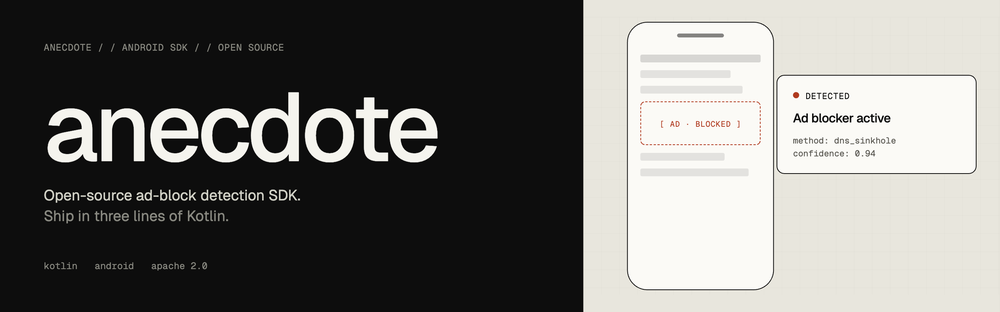

# anecdote: Open-Source Ad-Block Detection SDK for Android

<p align="center">
  
</p>

[](LICENSE)
[](https://github.com/Leesin0222/anecdote/releases)
[](https://github.com/Leesin0222/anecdote/stargazers)
[](https://kotlinlang.org)
[](https://developer.android.com)

**English** · [한국어](README.ko.md)

## Overview

`anecdote` is an open-source Android SDK that detects whether the user is blocking ads — without coupling itself to any particular ad network. Instead of trusting a single signal, it fuses three independent sources of evidence (HTTP reachability probes, ad SDK callbacks, and network-environment telemetry) into a weighted score, and exposes the verdict as a `StateFlow<BlockState>`.

The project exists because the alternatives — guessing from `onAdFailedToLoad` alone, or paying for a closed-source detector that ships its own ad logic — both produce too many false positives to drive UX on. `anecdote` aims for a calibrated, debuggable verdict that an app team actually feels comfortable wiring into a reward gate or analytics funnel.

## Core Architecture

The SDK comprises three independent layers:

**Core (`anecdote-core`)**: the detection engine. Owns the Active Probe runner, the network-environment watcher, the policy/scoring config, and the `StateFlow<BlockState>` exposed to host code. Has zero dependency on any ad SDK.

**Adapters (`anecdote-adapter-admob`, …)**: bind a specific ad SDK's failure callbacks into the detector as additional signals. Adapters are completely optional — the Core works without any of them — but a connected adapter gives the detector a much sharper view of reality than HTTP probes alone. The bundled AdMob adapter additionally decomposes mediation chains so AppLovin / Unity / ironSource fills are recorded as separate signals.

**Reporters (`anecdote-reporter-firebase`, `anecdote-reporter-logcat`, …)**: receive state-change and per-signal events for analytics or debugging. Multiple reporters can be registered side-by-side and run independently of each other.

## Design Philosophy

Six load-bearing principles anchor the SDK:

1. **Ad-SDK independence** — the Core has no compile-time knowledge of any ad network; everything network-specific lives in an opt-in adapter module.
2. **Multi-signal fusion** — no single failure mode (a flaky probe, one unlucky `onAdFailedToLoad`) can trip a verdict by itself.
3. **Score-based verdict with confidence** — the public surface is `Unknown / NotBlocked / Suspected / Blocked`, each `Blocked` carrying a `Confidence` so host UX can stay quiet on `LOW` and act on `HIGH`.
4. **False-positive defense by default** — cold-start grace period, network-transition session reset, and automatic exclusion of regions where Google ads are unavailable (China, etc.) are built in.
5. **Consent-aware** — when the host uses UMP, consent-denial-induced load failures are filtered out before they enter the score, so GDPR/CCPA flows don't get mislabeled as ad-blocking.
6. **Detection only, response is the host's** — the SDK does not nag, gate, or modify any UI. How (and whether) to react to `Blocked` is left entirely to the host app, which keeps Play Store policy risk on the host's side of the line.

## Capabilities Inventory

**Signal sources** out of the box:

- **Active Probe** — HEAD requests against configurable ad domains (default: `pagead2.googlesyndication.com`, etc.) vs. control domains (`www.google.com`, `www.gstatic.com`). The delta in failure rate, not the absolute failure rate, is what feeds the score — so subway/elevator outages don't trigger Blocked.
- **Network environment** — VPN and Private DNS detection contribute weighted bonuses (`+10` and `+15`).
- **AdMob adapter** — wraps `AdListener`, `InterstitialAdLoadCallback`, `RewardedAdLoadCallback`, classifies errors (`NO_FILL` vs. real network failure), and decomposes mediation chains.
- **CustomSignalSource** — a public hook for any non-AdMob network, so a host app's existing AppLovin / Unity / ironSource callbacks can emit `emitLoadFailed` / `emitLoadSucceeded` without writing a full adapter.

**Reporters** out of the box:

- **`LogcatBlockEventReporter`** — `Log.d("anecdote", …)` for development.
- **`FirebaseBlockEventReporter`** — emits `adblock_state_changed` and (optionally) `adblock_signal` to Firebase Analytics; signal events are off-by-default-friendly so production traffic stays bounded.

**Score model**

- `probe delta × 80` — the dominant term.
- `avg load failure rate × 60` — averaged across registered ad SDK signals.
- `+10` for VPN, `+15` for Private DNS.
- Final score clamped to `0..100`; default thresholds `40 (Suspected)` / `70 (Blocked)`.

## Detection Model

The detector runs an evaluation loop while `start()` is in scope. On each tick it asks every registered `SignalSource` for fresh data, recomputes the score, and only emits a new `BlockState` when the verdict actually changes — `onStateChanged` is therefore inexpensive to wire up, while `onSignalReceived` reflects the raw firehose for hosts that want it.

Two guards reduce false positives without dampening real detections:

- **Grace period (`gracePeriodMs`, default 5s)** — after cold start or after a network change, the detector stays `Unknown` until enough evidence has accumulated.
- **Per-session re-evaluation cap (`maxEvaluationsPerSession`, default 3)** — a confirmed `Blocked` with `Confidence.HIGH` stops re-evaluating until the network environment changes; lower-confidence verdicts keep re-evaluating up to the cap.

Network transitions (Wi-Fi ↔ cellular, VPN toggle, Private DNS change) automatically reset the session, so a brief in-tunnel outage cannot persistently flip a user to `Blocked`.

## Quick Start

```kotlin
val detector = AdBlockDetector.Builder(applicationContext)
    .addReporter(LogcatBlockEventReporter())
    .build()

detector.start()

lifecycleScope.launch {
    detector.state.collect { state ->
        when (state) {
            is BlockState.Blocked -> handleBlocked(state.confidence)
            else -> Unit
        }
    }
}
```

For AdMob hosts, wire the adapter into the existing ad lifecycle:

```kotlin
val gmaSource = GmaSignalSource(consentChecker = UmpConsentChecker(consent))
detector.registerSignalSource(gmaSource)

adView.adListener = gmaSource.adListener(delegate = myExistingListener)
InterstitialAd.load(ctx, unitId, request, gmaSource.interstitialLoadCallback())
RewardedAd.load(ctx, unitId, request, gmaSource.rewardedLoadCallback())
```

> **Requirement**: your app must already depend on
> `com.google.android.gms:play-services-ads`. The adapter declares the GMA
> SDK as `compileOnly`, so adding `anecdote-adapter-admob` will not pull
> in (or override) any version of the ad SDK that your app is already
> using — this is what keeps the adapter compatible with hosts that ship
> their own ad stack, mediation setup, or lite/full GMA variants.

### Policy tuning

```kotlin
AdBlockDetector.Builder(context)
    .policy {
        thresholdSuspected = 40            // 0..100, default 40
        thresholdBlocked = 70              // 0..100, default 70
        maxEvaluationsPerSession = 3       // state transitions per session
        disabledRegionMccs = setOf(460)    // CN by default; add more as needed
    }
    .probe {
        timeoutMs = 3_000
        gracePeriodMs = 5_000
        intervalMs = 60_000
        // defaults: pagead2.googlesyndication.com (ad), www.google.com (control)
        // adDomains = listOf("pagead2.googlesyndication.com", ...)
        // controlDomains = listOf("www.google.com", "www.gstatic.com")
    }
    .build()
```

### Custom signal source (non-AdMob networks)

```kotlin
val appLovin = CustomSignalSource(networkId = "applovin")
detector.registerSignalSource(appLovin)

// in your existing AppLovin listener:
override fun onAdLoadFailed(adUnitId: String, error: MaxError) {
    appLovin.emitLoadFailed(
        errorType = ErrorType.NO_FILL,
        rawErrorCode = error.code,
        rawErrorMessage = error.message,
    )
}
override fun onAdLoaded(ad: MaxAd) {
    appLovin.emitLoadSucceeded()
}
```

### Custom reporter

```kotlin
class MyBackendReporter(private val api: MyApi) : BlockEventReporter {
    override fun onStateChanged(state: BlockState) { /* state transitions only */ }
    override fun onSignalReceived(signal: AdNetworkSignal) { /* every raw signal */ }
}

AdBlockDetector.Builder(context)
    .addReporter(MyBackendReporter(api))
    .build()
```

`onStateChanged` fires only when the verdict actually changes; `onSignalReceived` fires for every incoming signal and can be chatty under default probe cadence.

## Module Selection Matrix

Every module is opt-in; nothing you don't depend on lands in the final APK.

| Situation                                          | Modules                                                    |
| -------------------------------------------------- | ---------------------------------------------------------- |
| Detection only, no host response                   | `anecdote-core` + `anecdote-reporter-logcat`               |
| Production analytics                               | `anecdote-core` + `anecdote-reporter-firebase`             |
| AdMob host (with or without mediation)             | add `anecdote-adapter-admob`                               |
| Non-AdMob network                                  | use `CustomSignalSource`, or write a dedicated adapter     |
| Custom analytics backend                           | implement `BlockEventReporter` directly                    |

## Building

JDK 17+ is required. On macOS:

```bash
brew install openjdk@17
export JAVA_HOME=/opt/homebrew/opt/openjdk@17
```

Common targets:

```bash
# tests + sample APK
./gradlew assembleDebug testDebugUnitTest

# distributable AAR set
./gradlew collectAars
# → build/artifacts/anecdote-*-<version>.aar
```

## Repository Layout

- **`anecdote-core/`** — detector, probe runner, policy/scoring, network watcher, public `StateFlow<BlockState>` surface
- **`anecdote-adapter-admob/`** — Google Mobile Ads bindings, mediation chain decomposition, optional UMP-based consent filtering
- **`anecdote-reporter-firebase/`** — Firebase Analytics reporter (`adblock_state_changed`, `adblock_signal`)
- **`anecdote-reporter-logcat/`** — debug reporter
- **`sample/`** — runnable sample app, including "Fail" / "Success" buttons that drive a `CustomSignalSource` for end-to-end manual testing
- **`build-logic/`** — Gradle convention plugins, including the publishing convention

## Scope (Intentional Limits)

- **Detection only.** The SDK does not show a dialog, gate a feature, or attempt to disable the user's blocker. Any such response is the host app's call, and any Play Store policy risk lives with the host.
- **Android only.** iOS is out of scope; the ad ecosystem there is different enough that a port would be a separate project, not a port.
- **Internal validation first.** The SDK is being validated on real reward-app traffic before any decision about external promotion.

## License

Apache-2.0.

## Contributing

Issues and pull requests are welcome. The public interfaces (`SignalSource`, `BlockEventReporter`) are deliberately small — new adapters and reporters should fit through them rather than expanding the Core's surface area.